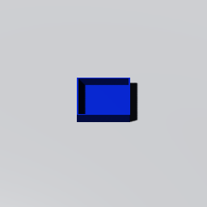
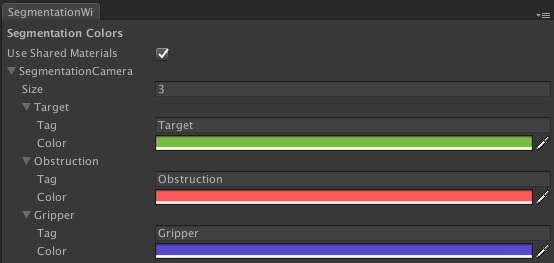
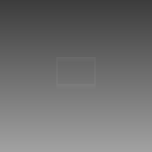
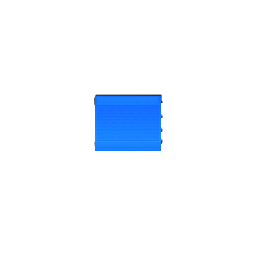

# Simulation

## Features

### Configurable Data Collection 
All machine learning relevant data from the simulation can easily be configured with in what format the data should be saved, where to saved it and how often.

(No images available yet)

### Scripted Behaviour Of A Gripper
- Pathfinding with collision avoidance
- Automated grasping of objects

### Different Camera Options
In the simulation environment it is possible to have multiple cameras, each with a different configurations for ease of collecting data for different purposes.

#### RGB Camera 
Regular Red-Green-Blue colorised images globally light with shadows and reflections

#### Segmentation
Each class of object in the scene can be given a unique distinguishable color, this eases identifying the different classes of objects from each other in the scene and their location.

#### Instance Segmentation
Similar to the segmentation camera configuration but instead now every instance of any class has a different color. (Note: missing "cleverer" coloring feature cause unwanted similarity of neighbour colors might occur... NP-Hard graph coloring problem)

(No animation available yet)

#### Depth
Darker shades are further away from camera while conversely the brighter are closer to the camera, useful for figure relative distances in the environment

#### Infrared Shadow
For more realistic depth images, this camera will provide information on overexposure and shadows due displacement of light source.

# Other Components Of the Neodroid Platform

- [agent](https://github.com/sintefneodroid/agent)
- [neo](https://github.com/sintefneodroid/neo)
- [droid](https://github.com/sintefneodroid/droid)
